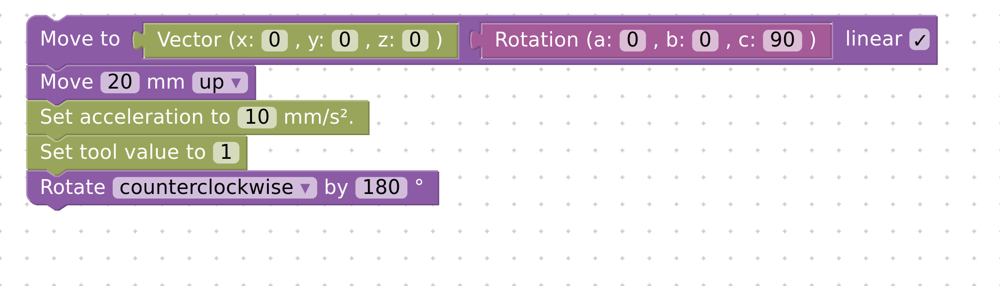
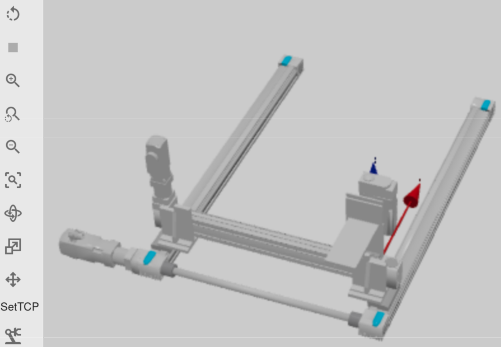

# AnwenderInnen-Dokumentation

Im Projekt netRob wurde ein webbasiertes Framework entwickelt, mit dem man Industrieroboter einfach grafisch programmieren und in 3D simulieren kann. Ziel war, dass Programme einerseits auf echten Industrierobotern ausführbar sein sollten und andererseits auch in der dazugehörigen Web-App einen virtuellen Roboter steuern und dessen virtuelles Umfeld, beispielsweise greifbare Objekte, beeinflussen könnten. Da Industrieroboter sehr kostspielig in der Anschaffung sind, als auch proprietäre Simulationssoftware für Industrieroboter, soll netrob SchülerInnen, die durch den Einsatz grafischer Programmiersprachen einen anfängerfreundlichen Zugang zur Programmierung und Industrierobotik ermöglichen. Das Framework kann aber auch von universitären Einrichtungen und privaten Personen für die Einführung im Robotik benutzt werden. Da die  Programmierumgebung auf  der HedgehogIDE aufbaut ist die AnwenderInnen-Dokumentation der HedgehogIDE relevant.

https://ide.pria.at/help 

In dieser wird erklärt wie man einfache Projekte und einfache Programme erstellt. 

## Neue Blöcke

Um Industrieroboter zu programmieren brauchte es neue Blocky Blöcke. Diese sind unter den Unterpunkten Fahren, Tooling und Mathe zu finden.  

## Simulationsumgebung

Um die Industrieroboter zu Simulieren gibt es folgende Möglichkeiten innerhalb der Simulationsumgebung. 

**Größe von Objekten/Robotern verändern**

**Objekte/Roboter verschieben**

**Objekte/Roboter rotieren**

**Set TCP**

Gibt die Möglicht den TCP (Tool Center Point) in der Simulation anzuklicken, um die Koordinaten und Orientierung des SetTCP Blocks auszufüllen

****

**Send to Robot**

Achtung dies ist nur als eingeloggter Lehrer/Admin möglich, da dann der Code an die echten Industrieroboter geschickt wird.  Es empfiehlt sich natürlich den Code vorher in der Simulation zu testen. 

**Send to Admin/Lehrer**

SchülerInnen und nicht eingeloggte Personen haben hier die Möglichkeit die Projekte an den Server hochzuladen damit LehrerInnen diese überprüfen bzw. auf den echten Industrierobotern auführen lassen können.

Bei LehrerInnen/Admins sind diese Programme dann bei den Projekten im Abschnitt Aufgaben zu finden.

